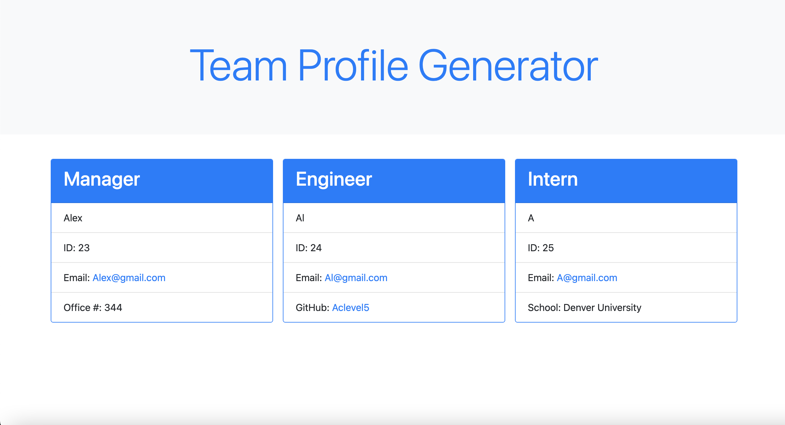

# Team-Profile-Generator

## Table of Contents

- [Description](#description)
- [Technologies](#Technologies)
- [Usage](#usage)
- [Tests](#tests)
- [Questions](#questions)

## Description
This command-line application enables you to quickly access your teams informaton via a HTML page.

Link to Video Walkthrough:
https://drive.google.com/file/d/1UnaeDZAzSCsK1_M3KliYZqvBd1G5hu53/view

## Technologies
- JavaScript
- HTML
- Bootstrap
- Node.js
- Inquirer
- Jest
- Nodemon

## Usage
Start program in Node.JS or terminal. Once started it will prompt you questions for the Manager. Once complete it will than prompt if you would like to add an Engineer, Intern, or Finish building team.
Manager, Intern, and Engineer will create new cards on the HTML page as they are entered. When finishing it will plug in the end of the HTML to create a complete webpage to access your teams info.

## Tests
Test are run on the classes to ensure they are returning the correct arguments that are passed on as well as ensuring the methods within the classes work. Can be run by NPM Test

## Questions
GitHub: [Aclevel5's GitHub](https://github.com/Aclevel5)

